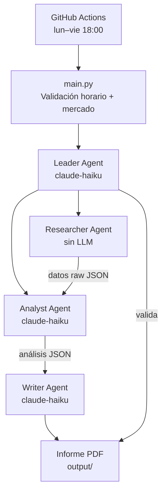

# IBEX 35 — Informe Diario Automático

Sistema multi-agente que genera informes PDF del mercado español de forma automática cada día hábil a las 18:00 (Madrid), usando la API de Claude.

---

## Arquitectura



| Agente | Responsabilidad | Escribe archivos |
|---|---|---|
| **Leader** | Orquesta el pipeline y valida el resultado final | No |
| **Researcher** | Descarga precios, volúmenes y noticias (yfinance + RSS) | `data/raw/` |
| **Analyst** | Análisis técnico y fundamental con LLM | `data/analysis/` |
| **Writer** | Redacta el informe y genera el PDF con gráficos | `output/` |

---

## Estructura

```
├── agents/
│   ├── leader.py        # Orquestador y validador
│   ├── researcher.py    # Recopilación de datos (sin LLM)
│   ├── analyst.py       # Análisis con Claude
│   ├── writer.py        # Generación de PDF
│   └── ibex_data.py     # Composición y caché del IBEX 35
├── skills/              # Prompts de sistema de cada agente
├── data/
│   ├── raw/             # JSONs de mercado
│   └── analysis/        # JSONs de análisis
├── output/              # Informes PDF generados
├── logs/                # Logs de ejecución
└── main.py              # Punto de entrada
```

---

## Instalación

```bash
python -m venv .venv && source .venv/bin/activate   # Windows: .venv\Scripts\activate
pip install -r requirements.txt
cp .env.example .env   # añade ANTHROPIC_API_KEY
```

**.env mínimo:**
```env
ANTHROPIC_API_KEY=sk-ant-...
```

---

## Uso

```bash
# Ejecución normal (respeta horario de mercado)
python main.py

# Forzar ejecución fuera de horario
FORCE_RUN=true python main.py
```

El script verifica que el mercado haya abierto hoy y que la hora sea entre las 17:35–19:00 (Madrid). Fuera de esas condiciones sale sin error.

---

## CI/CD — GitHub Actions

El workflow `.github/workflows/ibex35_report.yml` se ejecuta automáticamente:
- **Automático:** lunes a viernes a las 16:00 UTC (18:00 Madrid)
- **Manual:** `workflow_dispatch` con opción `force_run=true`

El PDF generado se sube como artefacto del workflow.

**Secret requerido:** `ANTHROPIC_API_KEY` en los secrets del repositorio.

---

## Variables de entorno

| Variable | Default | Descripción |
|---|---|---|
| `ANTHROPIC_API_KEY` | — | **Obligatorio** |
| `MODEL_LEADER` | `claude-haiku-4-5-20251001` | Modelo del orquestador |
| `MODEL_ANALYST` | `claude-haiku-4-5-20251001` | Modelo del analista |
| `MODEL_WRITER` | `claude-haiku-4-5-20251001` | Modelo del redactor |
| `FORCE_RUN` | `false` | Ignora validación de horario |
| `MAX_RETRIES` | `3` | Reintentos por agente |
| `IBEX_CACHE_DAYS` | `7` | Días de validez de la caché del IBEX |

---

## Stack

`Python 3.11` · `anthropic` · `yfinance` · `pandas` · `matplotlib` · `reportlab` · `feedparser`
