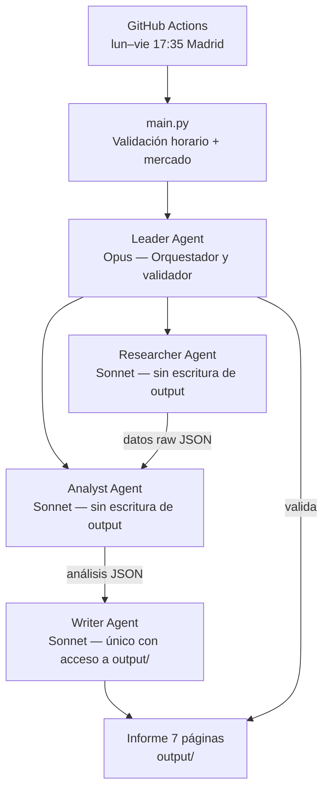

# IBEX 35 — Informe Diario Automático

Sistema multi-agente que genera informes del mercado español de forma automática cada día hábil a las 17:35 (Madrid), usando la API de Claude.

---

## Arquitectura



| Agente | Módulo | Modelo | Escribe |
|---|---|---|---|
| **Leader** | `agents/leader.py` | Opus | No |
| **Researcher** | `agents/researcher.py` | Sonnet | `data/raw/` |
| **Analyst** | `agents/analyst.py` | Sonnet | `data/analysis/` |
| **Writer** | `agents/writer.py` | Sonnet | `output/` |

El Researcher y el Analyst se lanzan **en paralelo**. El Writer arranca solo cuando ambos terminan. El Leader valida el informe final antes de darlo por completado.

---

## Estructura

```
├── agents/
│   ├── leader.py        # Orquestador y validador final
│   ├── researcher.py    # Recopilación de datos de mercado (yfinance + RSS)
│   ├── analyst.py       # Análisis técnico y fundamental con LLM
│   ├── writer.py        # Generación del informe con gráficos
│   ├── ibex_data.py     # Composición y caché del IBEX 35
│   └── utils.py         # Helpers compartidos (logging, limpieza de runs)
├── .claude/
│   ├── CLAUDE.md        # Contexto y reglas para Claude Code
│   ├── architecture.md  # Diagrama detallado del pipeline
│   ├── decisions.md     # Log de decisiones de diseño
│   └── estado_actual.md # Estado operativo actual del sistema
├── data/
│   ├── raw/             # JSONs de mercado (output del Researcher)
│   └── analysis/        # JSONs de análisis (output del Analyst)
├── output/              # Informes generados, un archivo por día
├── logs/                # Logs de ejecución: run_YYYY-MM-DD.log
└── main.py              # Punto de entrada
```

---

## Informe generado (7 páginas)

1. Cabecera macro — 10 indicadores clave
2. Tabla resumen IBEX 35 — precio, variación, volumen, señal técnica
3. Mapa de calor sectorial
4. Gráfico de 52 semanas
5. Atribución de rentabilidad
6. Ideas de mercado
7. Calendario económico

---

## Instalación

```bash
python -m venv .venv && source .venv/bin/activate   # Windows: .venv\Scripts\activate
pip install -r requirements.txt
cp .env.example .env   # añade ANTHROPIC_API_KEY y variables opcionales
```

---

## Uso

```bash
# Ejecución normal (respeta horario de mercado: 17:35–19:00 Madrid)
python main.py

# Forzar ejecución fuera de horario (tests, desarrollo)
FORCE_RUN=true python main.py
```

---

## CI/CD — GitHub Actions

El workflow `.github/workflows/ibex35_report.yml` se ejecuta automáticamente:
- **Automático:** lunes a viernes a las **18:30 Madrid** todo el año — dos entradas de cron (`30 16` y `30 17` UTC) para cubrir verano (UTC+2) e invierno (UTC+1). El segundo disparo del día es absorbido por una guardia en `main.py` que detecta si el informe ya fue generado.
- **Manual:** `workflow_dispatch` con opción `force_run=true`

El informe generado se sube como artefacto del workflow.

**Secret requerido:** `ANTHROPIC_API_KEY` en los secrets del repositorio.

---

## Variables de entorno

| Variable | Default | Descripción |
|---|---|---|
| `ANTHROPIC_API_KEY` | — | **Obligatorio** |
| `MODEL_LEADER` | `claude-opus-4-7` | Modelo del orquestador |
| `MODEL_ANALYST` | `claude-sonnet-4-6` | Modelo del analista |
| `MODEL_WRITER` | `claude-sonnet-4-6` | Modelo del redactor |
| `FORCE_RUN` | `false` | Ignora validación de horario |
| `MAX_RETRIES` | `3` | Reintentos por agente |
| `IBEX_CACHE_DAYS` | `7` | Días de validez de la caché del IBEX |

---

## Stack

`Python 3.11` · `anthropic` · `yfinance` · `pandas` · `matplotlib` · `reportlab` · `feedparser`
