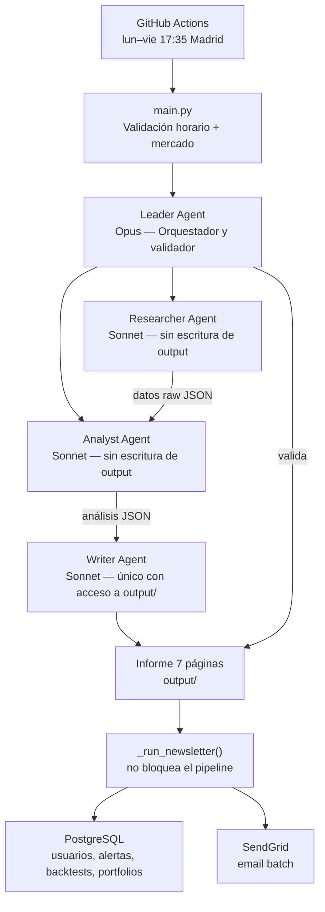

# IBEX 35 — Informe Diario Automático + Newsletter

Sistema multi-agente que genera informes del mercado español de forma automática cada día hábil a las 17:35 (Madrid), usando la API de Claude. Incluye newsletter por email, API REST con autenticación JWT, tiers Premium y PRO, y despliegue en Railway.

---

## Arquitectura



| Agente | Módulo | Modelo | Escribe |
|---|---|---|---|
| **Leader** | `agents/leader.py` | Opus | No |
| **Researcher** | `agents/researcher.py` | Sonnet | `data/raw/` |
| **Analyst** | `agents/analyst.py` | Sonnet | `data/analysis/` |
| **Writer** | `agents/writer.py` | Sonnet | `output/` |

El Researcher y el Analyst se lanzan **en paralelo**. El Writer arranca solo cuando ambos terminan. El Leader valida el informe final antes de darlo por completado. Tras el PDF, `_run_newsletter()` envía el email a los suscriptores activos — si falla, no afecta al pipeline.

---

## Estructura

```
├── agents/
│   ├── leader.py           # Orquestador y validador final
│   ├── researcher.py       # Recopilación de datos (yfinance + RSS)
│   ├── analyst.py          # Análisis técnico y fundamental
│   ├── writer.py           # Generación del informe + generate_newsletter_data()
│   ├── ibex_data.py        # Composición y caché del IBEX 35
│   └── utils.py            # Helpers compartidos (logging, limpieza de runs)
├── db/
│   └── models.py           # Modelos SQLAlchemy + get_db_session() (PostgreSQL)
├── services/
│   ├── email_formatter.py  # HTML mobile-friendly del newsletter
│   ├── email_sender.py     # Envío batch via SendGrid Personalizations API
│   ├── technical_analyzer.py  # SMA20, SMA50, RSI14, MACD vía yfinance
│   ├── alerts_engine.py    # Worker APScheduler: alertas 17:35 + reportes PRO lunes
│   ├── monitoring.py       # send_error_alert() + @monitor_errors (rate limit 1h)
│   ├── backtester.py       # Backtest determinista, estrategias JSON, límite 3/mes
│   ├── fundamental_analyzer.py  # fundamental_data() + data_quality_score()
│   ├── portfolio_tracker.py     # add_position, close_position, portfolio_summary
│   └── reporter.py         # generate_weekly_report(user_id) → PDF
├── api/
│   ├── flask_app.py        # App factory — registra 6 blueprints, JWT fail-fast
│   ├── helpers.py          # get_db(), require_premium(), require_pro()
│   ├── auth.py             # Blueprint /auth/*  (JWT)
│   ├── newsletter.py       # Blueprint /register, /api/v1/newsletter/latest, /health
│   ├── premium.py          # Blueprint alertas + análisis técnico (tier premium/pro)
│   ├── pro.py              # Blueprint estrategias, backtests, portfolios, reporte (PRO)
│   ├── stripe.py           # Blueprint /stripe/create-checkout, /stripe/webhook
│   └── admin.py            # Blueprint /admin/metrics (X-Admin-Key)
├── frontend/
│   ├── dashboard.html      # SPA vanilla: auth, indicadores, alertas, upgrade
│   └── admin_dashboard.html  # KPIs en tiempo real — actualización cada 5 min
├── .claude/
│   ├── CLAUDE.md           # Contexto y reglas para Claude Code
│   ├── architecture.md     # Diagrama detallado del pipeline
│   ├── decisions.md        # Log de decisiones de diseño
│   ├── estado_actual.md    # Estado operativo actual del sistema
│   └── skills/             # System prompts de cada agente
├── tests/
│   ├── conftest.py
│   ├── test_smoke.py       # 24 smoke tests
│   └── test_phase3.py      # 24 tests Fase 3 (backtester, fundamental, portfolio)
├── data/
│   ├── raw/                # JSONs de mercado (output del Researcher)
│   └── analysis/           # JSONs de análisis + newsletter_YYYY-MM-DD.json
├── output/                 # Informes PDF diarios + reportes semanales PRO
├── logs/                   # Logs de ejecución: run_YYYY-MM-DD.log
├── railway.toml            # Configuración Railway (2 servicios: web + worker)
├── Procfile                # Fallback Heroku-style
├── DEPLOY.md               # Guía de deploy en Railway (paso a paso)
└── main.py                 # Punto de entrada
```

---

## Informe generado (7 páginas)

1. Cabecera macro — 10 indicadores clave
2. Tabla resumen IBEX 35 — precio, variación, volumen, señal técnica
3. Mapa de calor sectorial
4. Gráfico de 52 semanas
5. Atribución de rentabilidad
6. Ideas de mercado
7. Calendario económico

---

## Instalación

```bash
python -m venv .venv && source .venv/bin/activate   # Windows: .venv\Scripts\activate
pip install -r requirements.txt
cp .env.example .env   # rellenar variables (ver sección de variables de entorno)

# Crear tablas en PostgreSQL (solo la primera vez)
python -c "from dotenv import load_dotenv; load_dotenv(); from db.models import create_tables; create_tables()"
```

---

## Uso

```bash
# Ejecución normal (respeta horario de mercado: 17:35–19:00 Madrid)
python main.py

# Forzar ejecución fuera de horario (tests, desarrollo)
FORCE_RUN=true python main.py          # bash/Linux
$env:FORCE_RUN="true"; python main.py  # PowerShell

# Arrancar la API Flask
python api/flask_app.py

# Arrancar el worker de alertas
python services/alerts_engine.py
```

---

## CI/CD — GitHub Actions

El workflow `.github/workflows/ibex35_report.yml` se ejecuta automáticamente:
- **Automático:** lunes a viernes a las **18:30 Madrid** todo el año — dos entradas de cron (`30 16` y `30 17` UTC) para cubrir verano (UTC+2) e invierno (UTC+1). El segundo disparo del día es absorbido por una guardia en `main.py` que detecta si el informe ya fue generado.
- **Manual:** `workflow_dispatch` con opción `force_run=true`

El informe generado se sube como artefacto del workflow.

**Secrets requeridos:** `ANTHROPIC_API_KEY`, `DATABASE_URL`, `SENDGRID_API_KEY`, `SENDGRID_FROM_EMAIL`.

---

## Deploy en Railway

Ver `DEPLOY.md` para la guía completa. Resumen:

- 2 servicios: `web` (gunicorn) + `worker` (alerts_engine)
- PostgreSQL como plugin — `DATABASE_URL` se inyecta automáticamente
- `/health` como healthcheck de Railway: `{"status","db","sendgrid","stripe","timestamp"}`

---

## Variables de entorno

| Variable | Obligatoria | Descripción |
|---|---|---|
| `ANTHROPIC_API_KEY` | Sí | Clave API de Anthropic |
| `DATABASE_URL` | Sí | URL PostgreSQL (Railway la inyecta automáticamente) |
| `SENDGRID_API_KEY` | Sí | Clave API de SendGrid |
| `SENDGRID_FROM_EMAIL` | Sí | Email remitente verificado en SendGrid |
| `JWT_SECRET_KEY` | Sí | Mínimo 32 chars — la app no arranca sin ella |
| `STRIPE_SECRET_KEY` | Sí | Clave Stripe (dashboard → API Keys) |
| `STRIPE_WEBHOOK_SECRET` | Sí | Signing secret del webhook Stripe |
| `STRIPE_PREMIUM_PRICE_ID` | Sí | Price ID del plan Premium |
| `STRIPE_PRO_PRICE_ID` | Sí | Price ID del plan PRO |
| `ADMIN_API_KEY` | Sí | Header `X-Admin-Key` para `/admin/metrics` |
| `ADMIN_EMAIL` | Sí | Email que recibe alertas de errores críticos |
| `MODEL_LEADER` | No | Modelo del orquestador (default: claude-opus-4-7) |
| `MODEL_ANALYST` | No | Modelo del analista (default: claude-sonnet-4-6) |
| `MODEL_WRITER` | No | Modelo del redactor (default: claude-sonnet-4-6) |
| `FORCE_RUN` | No | `true` para ignorar validación de horario |
| `MAX_RETRIES` | No | Reintentos por agente (default: 3) |
| `IBEX_CACHE_DAYS` | No | Días de validez de la caché del IBEX (default: 7) |
| `FINNHUB_API_KEY` | No | Para noticias adicionales |
| `ALERTS_TIMEZONE` | No | Zona horaria del motor de alertas (default: Europe/Madrid) |
| `ALERTS_HOUR` / `ALERTS_MINUTE` | No | Hora de evaluación (default: 17:35) |
| `PORT` | No | Railway lo asigna automáticamente |
| `FLASK_DEBUG` | No | `true` solo en desarrollo local |

---

## Tests

```bash
python -m pytest tests/ -v   # 48 tests — smoke + fase 3
```

---

## Stack

`Python 3.11+` · `anthropic` · `yfinance` · `pandas` · `matplotlib` · `reportlab` · `feedparser` · `SQLAlchemy` · `psycopg2` · `Flask` · `flask-jwt-extended` · `bcrypt` · `stripe` · `APScheduler` · `gunicorn` · `sendgrid` · `python-dotenv`
